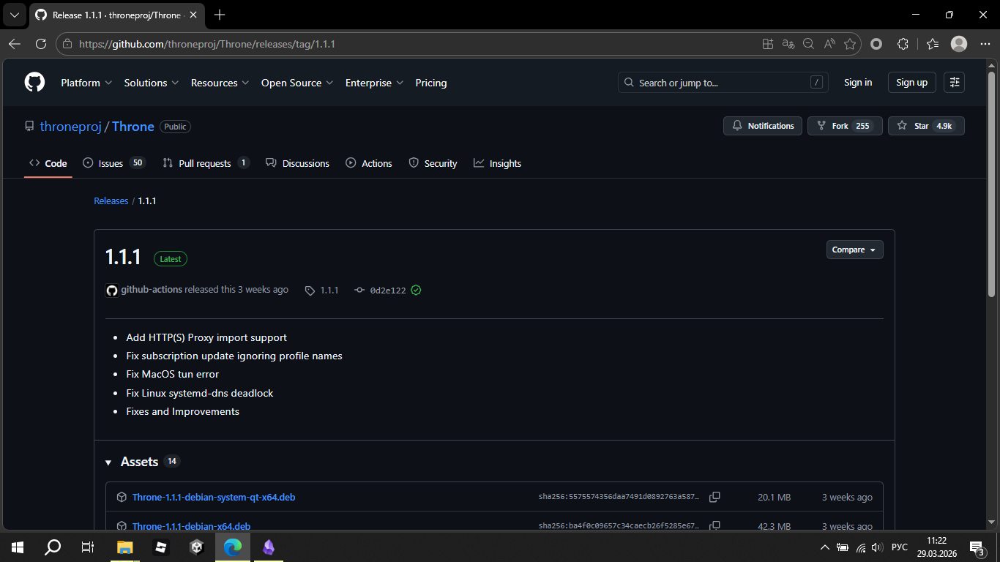

> ❗ Только в образовательных целях ❗

Сейчас, я расскажу, как воспользоватся Throne (в прошлом NekoBox) на ПК, чтобы получить VPN для любых ваших целей (например, для доступа к Gemini).

Первым делом, нужно установить сам Throne.
Для этого, пойдём на гитхаб проекта:
https://github.com/throneproj/Throne/releases/latest
Это ссылка на самый последний релиз (на самый новый апдейт, самая свежая версия)

  

У вас будет что-то типо вот такой страницы, где 1.1.1 - номер версии, она может отличатся. Нам нужно долистать до Assets, и пролистать ниже, и найти нужную версию:
> `Throne-версия-windows64-installer.exe` - Установщик, если вы хотите чтобы Throne был в системе и мог к примеру автозапускатся с системой, или чтобы иметь быстрый доступ к нему
> `Throne-версия-windows64.zip` - Portable версия, версия где устанавливать ничего не надо. Далее я буду рассматривать всё на её примере

Важно - если у вас старый компьютер, старая винда 32-битная, то вам нужно установить с припиской не windows64, а windows32. Но зачастую, всем подходит именно windows64.

Так как я буду дальше рассматривать Portable версию, при скачивании, у нас будет zip архив. Его нужно распаковать:
![[Pasted image 20260329112705.png]]

Когда распаковали, заходим, переходим в папку Throne внутри и запускаем Throne.exe

![[Pasted image 20260329112758.png]]

Если у вас будет окно с защитником Windows, смело принимаем. Так же может наругатся Windows Defender, так как "файл неизвестный" типо, хотя вирусов нет, всё в порядке.
![[Pasted image 20260329112938.png]]

Проверка на VirusTotal выше.

![[Pasted image 20260329113047.png]]

Когда мы открыли Throne, перед нами предстоит такой интерфейс.
Снизу - вкладка "логи", это записи программы, что она делает. Нам это не особо нужно.
Есть вкладки, изначально у нас вкладка "Default" - стандартная.
Так же, есть кнопки "Режим TUN" и "Системный прокси". 
> "Режим TUN" - "обволакивает" весь трафик системы. Простыми словами - все программы, звонки и тп будут идти через Throne - через VPN.
> "Системный прокси" - в отличии от "Режим TUN", не обволакивает систему, а заставляет все программы думать, что нужно всё посылать в Throne. Но, это не всегда работает, и звонки в некоторых приложениях работать не будут, многие игры не будут работать, не будет запускаться Roblox. (все UDP запросы не будут пропускатся). Не советую.

Ставим галочку около "Режим TUN"

![[Pasted image 20260329113555.png]]

Throne попросит запустится от имени администратора, потому что обволакивать весь трафик без прав админа нельзя. 
Принимаем.

![[Pasted image 20260329113655.png]]

Должно быть вот так - в названии окна `[Admin] [Tun] Throne версия`, если так, то значит всё в порядке.

Теперь, нам нужно дать программе понять, куда вообще подключатся.
Воспользуемся бесплатными открытыми источниками - копируйте любую ссылку ниже, и следуйте шагам далее.

- https://raw.githubusercontent.com/igareck/vpn-configs-for-russia/refs/heads/main/BLACK_SS+All_RUS.txt
- https://raw.githubusercontent.com/igareck/vpn-configs-for-russia/refs/heads/main/WHITE-CIDR-RU-all.txt
- https://raw.githubusercontent.com/EtoNeYaProject/etoneyaproject.github.io/refs/heads/main/other

Допустим, скопировали первую. Теперь, нам нужно её вставить в программу.
Для этого, нажимаем "Профили", и "Добавить профиль из буфера обмена".

Тут у нас есть выбор - 
- `"Добавить профили в эту группу"` - все-все ключи ("сервера") добавятся в группу "Default". Это не очень хорошо, так как если так делать несколько раз, может получится "свалка" (слишком много серверов в одной группе), и программа будет лагать.
- `"Создать новую группу подписки"` - создастся новая группа рядом с Default, со всеми серверами.
Вторым и воспользуемся.
![[Pasted image 20260329114900.png]]

Должно быть как то так. В консоли появится, что добавились какие то сервера (у меня это Вьетнам). Тыкаем во вторую группу (`raw.githubusercontent.com`)

![[Pasted image 20260329115004.png]]

На этом моменте для удобства рекомендую развернуть программу на весь рабочий стол.

![[Pasted image 20260329115034.png]]

Вот так, хорошо.
Если мы начнём листать, то увидим, что тут ооочень много серверов. У меня около 360 серверов!
Чтобы узнать, какие сервера у нас точно работают, а какие - нет, тыкаем правой кнопкой мыши по названию группы, в которой находимся ( у меня на скриншотах это `raw.githubusercontent.com`), и тыкаем "Тест задержки всей группы".
И уходим пить чай, пока оно проверяется. Справа будут появлятся результаты в теста, в соответствующей колонке. Мы можем листать, и смотреть, что он проверил, а что нет. Ждём окончания проверки.

![[Pasted image 20260329115432.png]]

В логах будет написано "Тест задержки завершён!"
Значит, всё окей, у нас завершилась проверка. `Unavaliable` в "Результат теста" означает, что сервер недоступен. Так же, чем меньше пинга (`130 ms` - пинг), тем лучше. Чтобы убрать все недоступные, жмём ПКМ (правой кнопкой мыши) по названию группы (надеюсь, не нужно ещё раз напоминать, что это `raw.githubusercontent.com`, да? :3), и нажимаем "Удалить недоступные"
![[Pasted image 20260329115714.png]]

![[Pasted image 20260329115728.png]]

И подтверждаем. Теперь, чтобы не искать ключ с самым маленьким пингом, сделаем удобство для себя - кликнем на название колонки "Результат теста", чтобы отсортировать ключи.
![[Pasted image 20260329115850.png]]
Вот, у меня есть ключ на 65 пинга! Это очень хорошо. Но не спешим подключатся. Некоторые ключи говорят, что типо работают, а на самом деле нет. Поэтому, тут два пути:
- На абум подключать ключи, пытаясь найти рабочие
- Либо доверить всё программе - запустить спидтест (проверка скорости (логично, что если скорость есть, значит ключ точно рабочий)) - жмём опять ПКМ по названию группы, и тыкаем "Тест скорости задержки всей группы". Это обычно длится долго, тем более если ключей много, так что советую пока оно идёт заварить доширак и плотненько поесть.
Хотя, необязательно дожидатся проверки полностью - если уже нашли ключ с хорошей скоростью (обычно, больше 20 Мбит/сек уже хорошо), то значит искать дальше нам пока не надо, поэтому тыкаем ПКМ на название группы, и нажимаем "Остановить тестирование", чтобы тестирование не шло дальше.

![[Pasted image 20260329120445.png]]

Вот, у меня к примеру есть хороший первый ключ, Germany, Германия - как раз Gemini скорей всего будет работать. Тыкаем ПКМ по ключу, и нажимаем "Запустить". Только убедитесь, что "Режим TUN" включён!
![[Pasted image 20260329120704.png]]

![[Pasted image 20260329120718.png]]

Если появилось предупреждение, ставим две галочки и разрешаем.
![[Pasted image 20260329120743.png]]
Должно быть как то так - возле ключа слева вместо номера поставилась галочка, а справа попрыгал трафик. Так же иконка в режиме "TUN" всегда меняется на красную (означает, что работает).
Теперь, погнали проверять!

![[Pasted image 20260329121042.png]]

Заходим на 2ip.ru, и видим, что мы в Германии! VPN работает. Не бойтесь, что скорость плохая. Всё таки это общественные ключи, ими могут пользоватся до сотни людей одновременно. Самое главное, этой скорости обычно достаточно чтобы выйти на связь в ТГ. Найти по настоящему быстрый ключ - джекпот. Иногда те, что с большим пингом, работают лучше, тем те, что с маленьким. Тут всё зависит от удачи, и терпения!

![[Pasted image 20260329121507.png]]

Я смог на этом ключе стабильно запустить YouTube на 1080p. 

![[Pasted image 20260329121535.png]]

Gemini тоже работает.

Сразу хочу сказать одну важнейшую вещь - НЕ ожидайте, что ключ будет бесконечно долго хорошо работать. Он может спокойно оборвать соединение в моменте. Может не работать на следующий день. Если такое произойдёт, просто меняем на другой ключ, а предыдущий - удаляем (ПКМ по ключу - удалить). Если вдруг ключи закончились, то тыкаем ПКМ по названию группы - обновить подписку.

![[Pasted image 20260329121845.png]]

Так же, не забывайте выключать VPN перед выключением компьютера. А то программа может залагать, писать что типо "приложение не отвечает", и там предложит перезапуск - отказываемся, ждём немного, и там нажимаем "Сброс". После этого, когда заново запустите, то должно работать.

